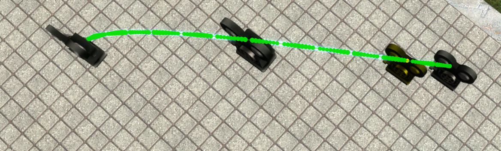

# Catmull-Rom Cinematic Cameras

  

  Advanced Camera (in yellow) with its motion path (in green) following a Catmull-Rom spline (the blue beam)

This fork interfaces Stop Motion Helper with Catmull-Rom Cinematic Cameras (CRCCams).

### Usage
1. Create a CRCCam track layout.
2. Spawn a camera (regular camera or Advanced Camera)
3. If you have SMH installed, select the new tool labeled Stop Motion Helper in the Interfaces tab.
4. Select the camera that you just spawned.
5. Press the key that you have bound to view the track.
6. If all goes well, you should see the interfaced camera in your view.
7. If you see text indicating that physics recording has stopped, your camera should be baked! Verify that the camera follow the CRCCam track.
